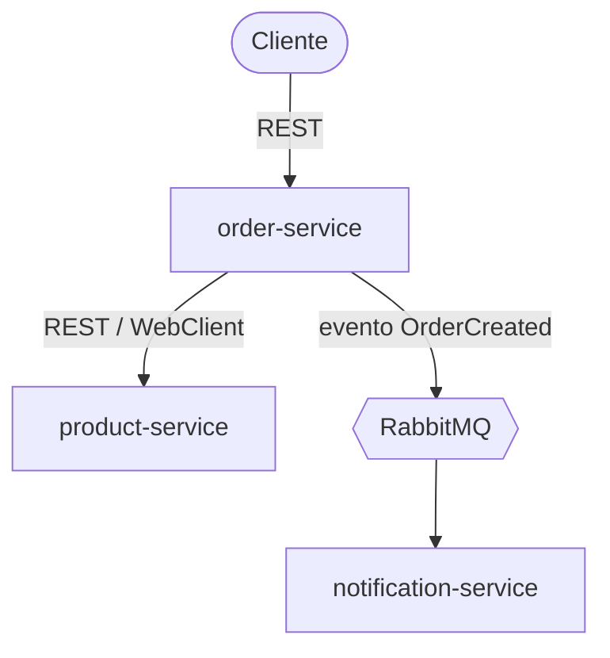

# 🧩 Microservicos Pedidos

Projeto pessoal de estudo com o objetivo de praticar arquitetura de microsserviços "como o mercado usa" — espaço
dedicado para aprender arquitetura distribuída, boas práticas de organização (Jira, ADRs, contratos OpenAPI) e,
futuramente, Angular no consumo dos serviços.

## 🔎 Visão geral

Sistema simples de pedidos, dividido em 3 serviços independentes:

- 📦 **`product-service`** — catálogo de produtos e controle de estoque
- 🧾 **`order-service`** — criação e consulta de pedidos, validando estoque via chamada síncrona ao `product-service` e
  publicando eventos assíncronos após a criação
- 🔔 **`notification-service`** — consome eventos de pedido criado e simula o envio de notificações

Fluxo resumido:



Cada serviço possui seu próprio banco de dados (Postgres), reforçando o isolamento entre eles — nenhum serviço acessa
diretamente o banco de outro.

## 🏗️ Arquitetura

- **Estilo arquitetural:** MVC em camadas (Controller → Service → Repository → Model/DTO → Exception) nesta fase
  inicial, com refatoração planejada para Arquitetura Hexagonal (Ports & Adapters) como evolução futura.
- **Comunicação síncrona:** WebClient (Spring WebFlux) para chamadas REST entre serviços.
- **Comunicação assíncrona:** RabbitMQ, com o `order-service` publicando o evento `OrderCreated` (payload com dados
  completos) e o `notification-service` consumindo.
- **Persistência:** Postgres via Docker, um banco dedicado por serviço (Database per Service).
- **Dados:** o pedido armazena um snapshot (nome e preço) do produto no momento da compra, em vez de apenas uma
  referência ao ID — evitando que mudanças futuras no catálogo alterem pedidos já criados.
- **Contratos de API:** definidos em OpenAPI (`openapi.yaml`) dentro de cada serviço, antes da implementação.

As decisões de arquitetura e seus motivos estão documentadas em [`docs/adr/`](./docs/adr).

## 📁 Estrutura do repositório

```
microservicos-pedidos/
├── 🐳 docker-compose.yml
├── 📄 README.md
├── 📁 docs/
│   └── 📁 adr/
├── 📁 order-service/
│   ├── 📁 src/
│   ├── 📝 openapi.yaml
│   ├── ⚙️ pom.xml
│   └── 🐳 Dockerfile
├── 📁 product-service/
│   ├── 📁 src/
│   ├── 📝 openapi.yaml
│   ├── ⚙️ pom.xml
│   └── 🐳 Dockerfile
├── 📁 notification-service/
│   ├── 📁 src/
│   ├── 📝 openapi.yaml
│   ├── ⚙️ pom.xml
│   └── 🐳 Dockerfile
└── 📁 client-angular/
    ├── 📁 src/
    ├── ⚙️ package.json
    └── 🐳 Dockerfile
```

## 🛠️ Stack técnica

| Camada                 | Tecnologia                  |
|------------------------|-----------------------------|
| Backend                | Java + Spring Boot          |
| Comunicação síncrona   | WebClient (Spring WebFlux)  |
| Comunicação assíncrona | RabbitMQ                    |
| Banco de dados         | PostgreSQL (um por serviço) |
| Documentação de API    | OpenAPI 3.0.3 (Swagger)     |
| Containerização        | Docker / Docker Compose     |
| Frontend               | Angular                     |
| Organização do projeto | Jira Cloud (board Kanban)   |

## 🚀 Como rodar o projeto

> ⚠️ Seção a ser preenchida conforme os serviços forem implementados.

```bash
docker-compose up
```

Isso deve subir:

- `product-service` e seu banco (`product-db`)
- `order-service` e seu banco (`order-db`)
- `notification-service`
- RabbitMQ (painel de gerenciamento disponível em `http://localhost:15672`)

Cada serviço expõe sua documentação Swagger em `/swagger-ui.html`.

## 🗺️ Roadmap de evolução

Após o esqueleto dos 3 serviços estar funcionando ponta a ponta:

1. API Gateway (Spring Cloud Gateway)
2. Service Discovery (Eureka)
3. Config Server (Spring Cloud Config)
4. Observabilidade / tracing distribuído (Zipkin ou Jaeger)
5. Circuit Breaker na chamada `order-service` → `product-service` (Resilience4j)
6. Refatoração de MVC em camadas para Arquitetura Hexagonal
7. Client Angular consumindo os serviços via Gateway

## 📋 Organização e acompanhamento

O desenvolvimento é acompanhado via Jira Cloud (board Kanban, projeto `KAN`), com a estrutura:

- **Epic** por serviço (+ um Epic "Documentação e Arquitetura" para ADRs e setup do repositório)
- **Story** por feature ou contrato de API
- **Subtask** com os passos técnicos, escritos antes de iniciar a implementação

## 📌 Status

🚧 Em desenvolvimento — projeto de estudo, sem deploy em produção.
